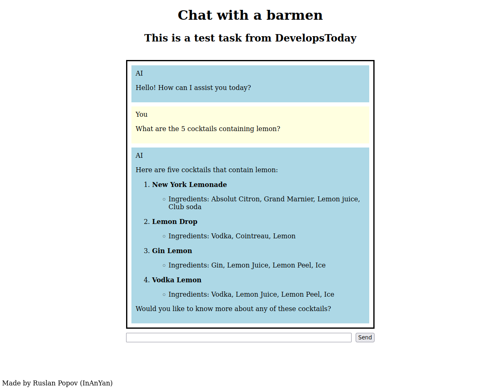
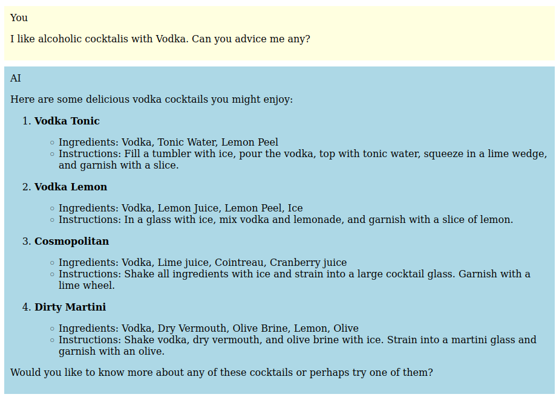
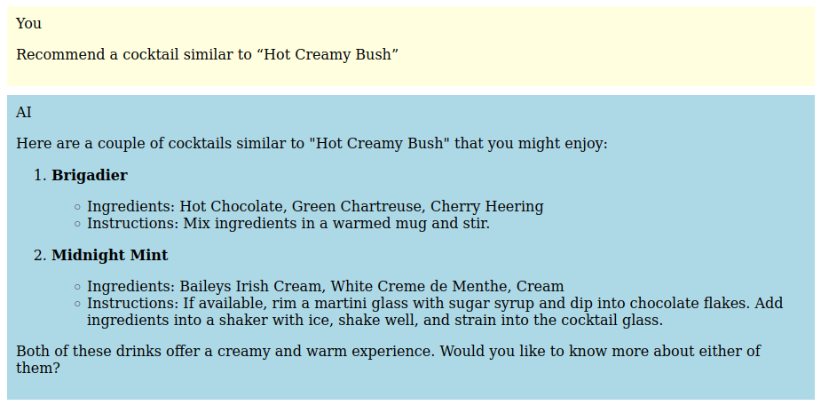

# AI barmen chat-bot



Made as a test task for `DevelopsToday`.

This bot knows a lot about cocktails!

## Features

- Friendly chat-bot.
- Remembers what you like.
- Has extensive knowledge of various cocktails.

### Remembers what you like



### Can find similar cocktails



## How to Run this Project?

First, install the dependencies:

```python
pip install -r requirements.txt
```

Then, you can run it as follows:

```python
fastapi dev src/main.py
```

In case that command didn't work, you can try this instead:

```python
python -m fastapi dev src/main.py
```

(*Ensure you have `fastapi[standard]` installed*).

## How this Project is Implemented?

Tech stack:
- FastAPI
- LangChain
- OpenAI API
- Chroma (vector database)

Architectural division (2 layers):
1. `src/main.py`: the web-server. Connects core logic to end user.
2. `src/logic.py`: core AI logic.

Key moments:
- Vector database is filled with data at the beginning of the program.
- Update user preference and search the vector database using tools.
- User preference is stored in system message.
- Conversation is stored in RAM (meaning, it's not persisted).